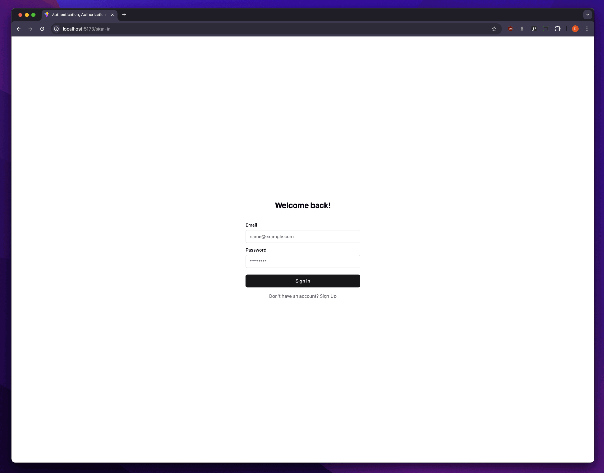

# jwt-authentication

This is a completely solution to handle with Authentication and Authorization build with React.js, Tailwind and Shadcn. The main goal of this application is provide a important piece of software that has present in the majority of the projects in real world.

|               Client                |
| :---------------------------------: |
|  |

## Installation

> [!IMPORTANT]
> To setup and run the **client**, ensure you have `Node.js (20.16.0)` installed.

### Clone the repository

```sh
git clone git@github.com:d0ugui/jwt-authentication.git
cd jwt-authentication
```

### Setup client

```sh
cd client
```

#### Install dependencies

```sh
npm i or pnpm i
```

#### Start the client

```sh
npm run dev or pnpm dev
```
