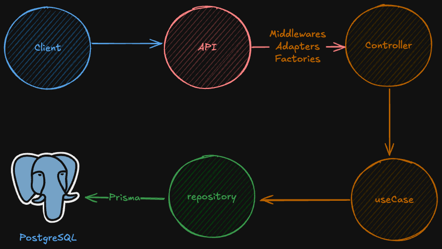

# jwt-authentication

This API is built with TypeScript, Express, Prisma, and Docker, following clean architecture principles. It implements robust authentication and authorization mechanisms using role-based access control (RBAC). The project employs design patterns like dependency inversion, dependency injection, and factory patterns to ensure scalability and maintainability. Features include user authentication, role-based permissions, and secure access to resources.

|          Server Structure           |
| :---------------------------------: |
|  |

## Installation

> [!IMPORTANT]
> To setup and run the **client**, ensure you have `Node.js (20.16.0)` installed.
>
> Remember to change the provided example variables to actual values ​​in the `.env` file.

### Clone the repository

```sh
git clone git@github.com:d0ugui/jwt-authentication.git
cd jwt-authentication
```

### Setup server

```sh
cd server
```

#### Create .env file

```sh
cp .env.example .env
```

#### Create and start the containers

```sh
docker compose up -d
```

#### Run database migrations

```sh
pnpm prisma migrate dev
```

#### Start the server

```sh
pnpm dev
```
